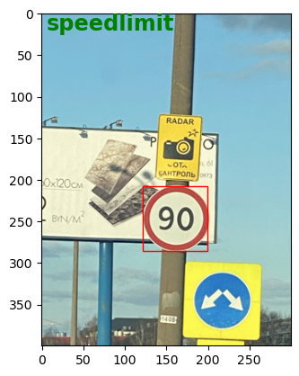

# Roadsign Detection

This project focuses on fine-tuning a FasterCNN-ResNet50 v1 model for road sign detection using the PyTorch library in combination with NumPy, Pandas, OpenCV, and other supporting libraries.

## Dataset

The dataset used for training and evaluation is obtained from [this Kaggle source](https://www.kaggle.com/datasets/andrewmvd/road-sign-detection/data).

### Dataset Details:
- **Number of Images**: 877 images
- **Classes**: 
  - Traffic Light
  - Stop Sign
  - Speed Limit Sign
  - Crosswalk Sign
- **Annotations**: Bounding box annotations are provided in the PASCAL VOC format within XML files for each image in the 'annotations' directory. These files contain ground truth data of boxes and labels for detected objects.
- **Images**: The 'images' directory contains images with annotated bounding boxes.

## Results

### Accuracy Scores based on Intersection over Union (IoU):

- **50% IoU**:
  - Accuracy: 0.78
  - Accuracy with correct label: 0.62
  
- **75% IoU**:
  - Accuracy: 0.75
  - Accuracy with correct label: 0.60
  
- **90% IoU**:
  - Accuracy: 0.48
  - Accuracy with correct label: 0.38

These accuracy scores indicate the model's performance at different IoU thresholds, measuring the overlap between predicted and ground truth bounding boxes.

### Example Image with Detections:

